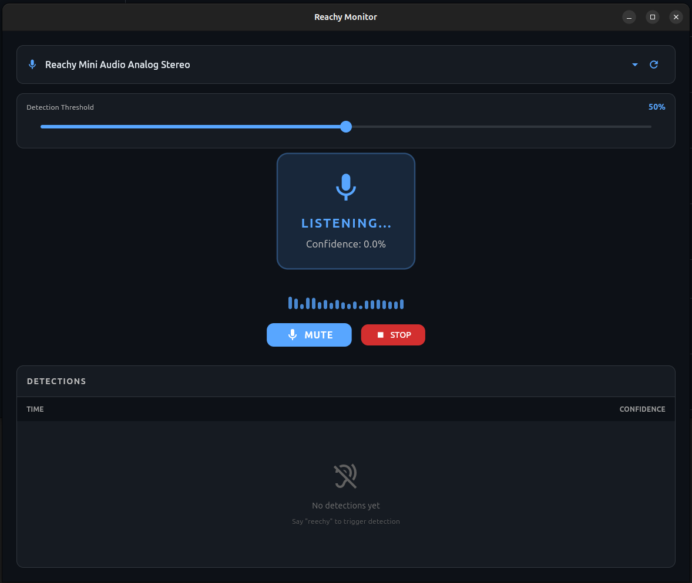
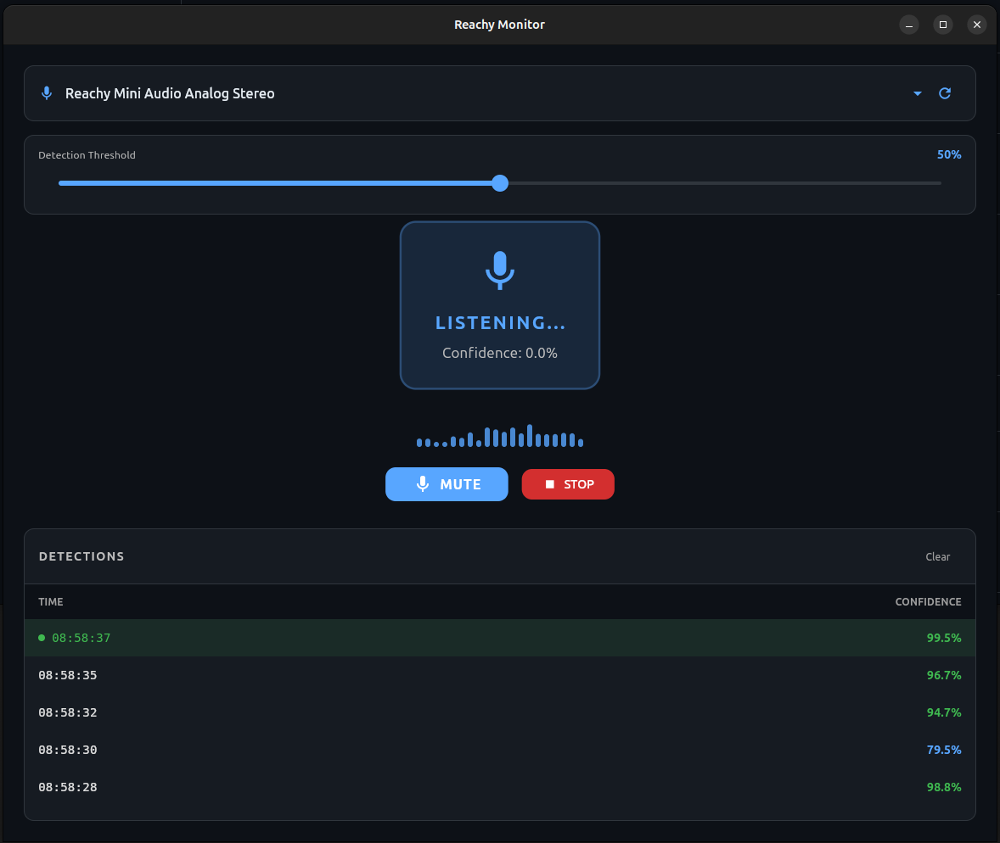

# Reachy WakeWord Monitor

A Flutter desktop application for real-time wake word detection monitoring on Reachy robots.

## Features

- **Real-time Audio Visualization** - Visual feedback of microphone input levels
- **Wake Word Detection** - Uses ONNX models for accurate "Reachy" wake word detection
- **Configurable Threshold** - Adjust detection sensitivity (10-90%)
- **Multiple Microphone Support** - Select from available audio input devices
- **Detection History** - View timestamped log of all wake word detections
- **Silent Microphone Warning** - Alerts when the selected microphone produces no audio

## Screenshots

### Listening Mode


### Wake Word Detected


## Requirements

### Linux
- Ubuntu 20.04+ or equivalent
- GTK 3.0+
- PulseAudio or PipeWire

### Development
- Flutter 3.24.0+
- Dart SDK
- Linux build tools: `clang`, `cmake`, `ninja-build`, `pkg-config`, `libgtk-3-dev`

## Installation

### From Release

1. Download the latest release from [Releases](https://github.com/andyjmorgan/Reachy-Wake-Word-Monitor-App/releases)
2. Extract the archive:
   ```bash
   tar -xzvf reachy-wakeword-monitor-linux-x64.tar.gz
   ```
3. Run the application:
   ```bash
   ./reechy_wakeword_monitor
   ```

### Build from Source

1. Clone the repository:
   ```bash
   git clone https://github.com/andyjmorgan/Reachy-Wake-Word-Monitor-App.git
   cd Reachy-Wake-Word-Monitor-App
   ```

2. Install dependencies:
   ```bash
   sudo apt-get install clang cmake ninja-build pkg-config libgtk-3-dev
   ```

3. Get Flutter packages:
   ```bash
   flutter pub get
   ```

4. Build the application:
   ```bash
   flutter build linux --release
   ```

5. The built application will be in `build/linux/x64/release/bundle/`

## Usage

1. Launch the application
2. Select your microphone from the dropdown (the Reachy Mini Audio device is recommended)
3. Adjust the detection threshold if needed (default: 50%)
4. Say "Reachy" to trigger detection
5. View detections in the history table

## Architecture

The application uses a pipeline approach for wake word detection:

1. **Audio Input** - Captures 16kHz mono audio in 80ms chunks
2. **Mel Spectrogram** - Converts audio to mel spectrogram features using ONNX model
3. **Embedding** - Generates 96-dimensional embeddings from spectrogram windows
4. **Wake Word Detection** - Classifies embeddings to detect the wake word

### ONNX Models

The wake word models are sourced from [reachy-wake-word](https://github.com/andyjmorgan/reachy-wake-word):

- `melspectrogram.onnx` - Audio to mel spectrogram conversion
- `embedding_model.onnx` - Spectrogram to embedding conversion
- `reechy_wakeword.onnx` - Wake word classification

## Development

### Running in Debug Mode

```bash
flutter run -d linux
```

### Hot Reload

Press `r` in the terminal while running to hot reload changes.

## CI/CD

This project uses GitHub Actions for continuous integration:

- **Build Workflow** - Builds on every PR and push to main
- **Release Workflow** - Creates bundled release artifacts when a release is published

## License

MIT License

## Acknowledgments

- Built for [Pollen Robotics](https://www.pollen-robotics.com/) Reachy robots
- Wake word models from [reachy-wake-word](https://github.com/andyjmorgan/reachy-wake-word)
- Wake word detection based on [openWakeWord](https://github.com/dscripka/openWakeWord)
